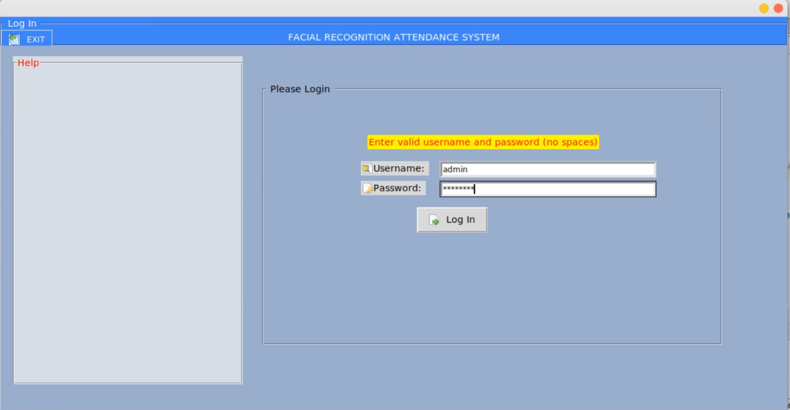

# Facial_Recognition_Based_Attendance_System
Python App that records attendance using facial recognition (With OpenCV face identification).

Demo for Computer Engineering Dept. University of Maiduguri, Nigeria.

Please note: This app can only be run on Ubuntu OS.

## Admin Login Screen

## Record Attendance Screen

## After Recording Attendance

The system takes less than 5secs to recognise faces. It obseletes the manual system of recording attendance by lecturers.

